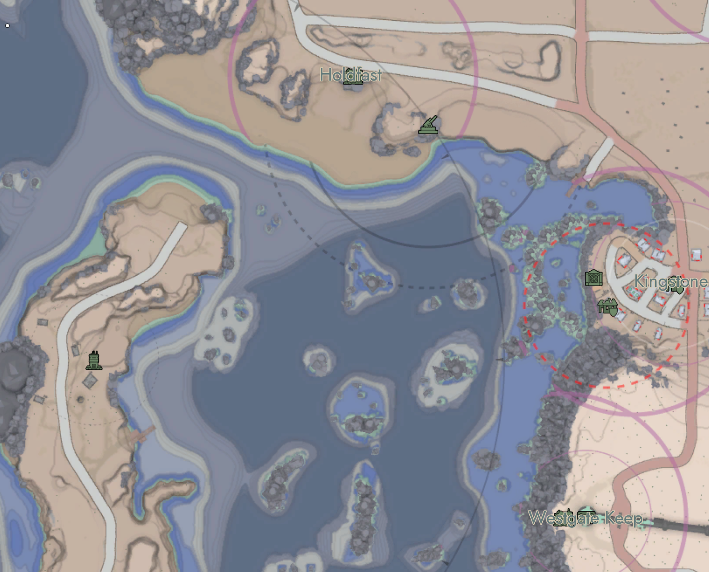
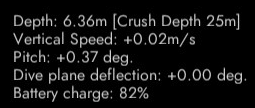
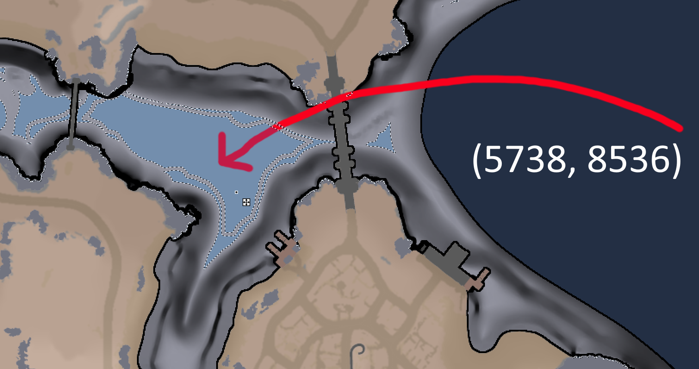
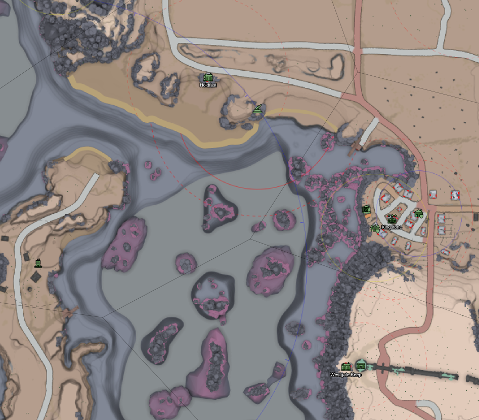
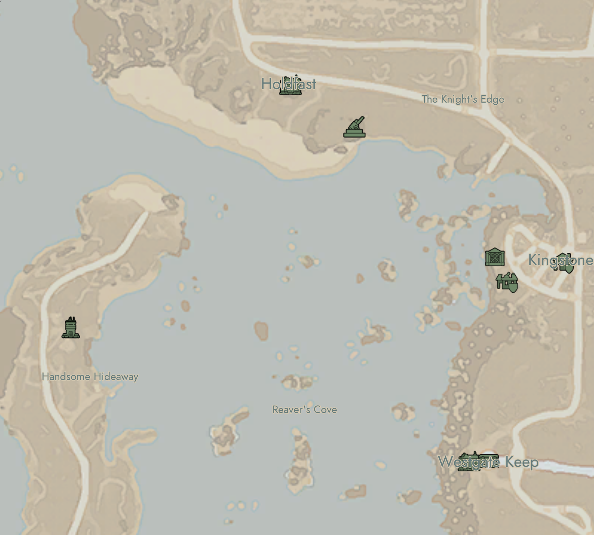

Knight of Science detailed depth coloring with custom AI ranges, in-game view. From [Foxhole](https://foxholestats.com/).

# Knight of Science Fork of [Tsekho/fh_map_exporter](https://github.com/Tsekho/fh_map_exporter/tree/main)

## Water Depth Band Coloring
This fork improves upon the work of Tsekho by altering how underwater geometry is rendered. Instead of applying a pink gradient to the underwater portion of only non-terrain meshes, all submerged geometry receives contour lines and is tinted a color associated with the depth band they fall into.

This information is valuable to large ship captains and submarine captains in-game. It's also useful to know which bodies of water can be driven through or walked through.

The values for depth bands were determined through the measurement of large ship hull drafts through in-game methods.

The legend image is generated by `legend_builder.py`.

This legend image is embedded onto the background image behind all map images so that it can be referenced in-game.

## Roadmap
Completed:
 - [x] Measure all in-game large ships and record / calculate important depths.
 - [x] Enable depth band coloring using relevant large ship depths.
 - [x] Enable contour line generation on underwater rocks in addition to terrain.
 - [x] Enable detailed and simple variants using only the most important depths.
 - [x] Generate `legend.png` and `legend_simple.png` for use by separate project to assemble final mod `.pak`.

 Planned:
 - [ ] Modify the contour generation to more closely resemble [Rustard's Improved Map Mod](https://rustard.itch.io/improved-map-mod)

 Low Priority:
 - [ ] Verify submerged contours near non-primary bodies of water (lakes) are correctly spaced.

 # Water Depths Explained
| Depth | Description |
| -------- | -------- |
| 1.0m | End of shallows. Up to this depth players can walk instead of swimming but can't sprint, land vehicles can be driven without being damaged. |
| 2.0m | End of drivable depth. Up to this depth land vehicles can be driven without being damaged. |
| 3.8m | BMS Bluefin draft. BMS Bluefin will beach in shallower waters. |
| 4.7m | BMS Longhook draft. BMS Longhook will beach in shallower waters. |
| 4.8m | Colonial Trident Submarine 0 ballast draft. Colonial Trident Submarine will beach in shallower waters. |
| 5.2m | BMS Bowhead draft. BMS Bowhead will beach in shallower waters. |
| 5.5m | Colonial Conqueror draft. Colonial Conqueror will beach in shallower waters. |
| 6.0m | Warden Callahan and Mercy draft. Warden Callahan and Mercy will beach in shallower waters. |
| 6.3m | Warden Nakki Submarine 0 ballast draft. Warden Nakki Submarine will beach in shallower waters. |
| 6.9m | Warden Frigate draft. Warden Frigate will beach in shallower waters. |
| 7.9m | Colonial Titan draft. Colonial Titan will beach in shallower waters. |
| 8.3m | Colonial Poseidon draft. Colonial Poseidon will beach in shallower waters. |
| 14.2m | Intel depth. Submarines cannot hide from intelligence in shallower waters. |
| 27.4m | Nakki crush depth. Warden Nakki Submarine capable of diving below crush depth in deeper waters. |
| 32.4m | Trident crush depth. Colonial Trident Submarine capable of diving below crush depth in deeper waters. |

Depths deeper than 32.4 aren't really relevant in-game so underwater geometry is not rendered past this depth.

Neither sub can go below 37.4m (equivalent to 30m from the dive officer)

## Removal of depth bands for detailed and simple variants
In order to increase the readability of the large ship drafts (aka beach depths) I cut down on the number of depth bands I rendered from 10 to 4.

**Detailed variant large ship beach depths:**
| Depth | Description |
| -------- | -------- |
| 4.8m | Trident, Longhook, and Bluefin will not beach in deeper waters |
| 6.3m | Nakki, Callahan, Mercy, Conqueror, and Bowhead will not beach in deeper waters |
| 6.9m | Frigate will not beach in deeper waters |
| 7.9m | Titan will not beach in deeper waters. |

**Simple variant large ship beach depths:**
| Depth | Description |
| -------- | -------- |
| 7.9m | All large ships are safe to traverse deeper waters |

## Note regarding the Colonial Poseidon's depth band removal
Note that I explicitly ignored that the Colonial Poseidon aircraft carrier had a deeper draft than the Titan because the Poseidon very very rarely navigates shallow water in a combat scenario. It's also the case that there were significant regions that would barely beach the Poseidon that would discourage Titan captains from navigating if our bottom depth band was at 8.3m instead of 7.9m.

# Measurement Experimental Methods
### Background

The draft of a ship is the vertical distance from the surface to the bottom of the hull.

0 ballast refers to when a submarine has all 3 ballast tanks completely empty of water (full of air). This is when a submarine is most buoyant.

The Colonial Trident and Warden Nakki Submarines have a "dive officer" or DO crew seat that displays the "current depth of the submarine" in meters.

This depth is NOT being measured at the bottom of the hull but instead from an invisible sensor located with a unique offset from the bottom of the hull for each of the two submarines.

Screenshot of dive officer display aboard a Colonial Trident.

There are several depths reported by dive officers that are relevant for both submarines. These submarine behaviors are tied to the dive officer reading, not where the bottom or top of the hull is.

| Depth | Description |
| -------- | -------- |
| 6.75m | Intel depth. Submarines cannot hide from intelligence in shallower waters. | 
| 20.0m | Nakki crush depth. Warden Nakki Submarine capable of diving below crush depth in deeper waters. |
| 25.0m | Trident crush depth. Colonial Trident Submarine capable of diving below crush depth in deeper waters. |
| 30.0m | Max depth. Neither sub can reach depths such that dive officer reads lower than 30.0m |

It becomes clear that for intel depth and crush depths the dive officer reading is what matters.

### Zero ballast dive officer reading

For a Trident with 0 water in ballast tanks, DO reports -2.64, meaning 2.64m above the water's surface.

For a Nakki with 0 water in ballast tanks DO reports -1.08, meaning 1.08m above the water's surface.

### Submarine model heights

To determine the "height" of a Trident we placed one trident on the floor of a river and positioned another immediately on top of it. Then we measured the difference in dive officer readings.

Trident at bottom DO: 12.3m
Trident on top of bottom Trident DO: 6.4m
12.3 - 6.4 = 5.9m tall Trident

We found the height of the Nakki through a similar method.

We found a Nakki anchored at the surface and visually confirmed that the ballast tanks were completely empty by looking at the model.
We positioned another Nakki directly below the surface anchored Nakki.
We measured the difference in DO readings.

Nakki at surface DO: -1.08m (1.08m above water)
Nakki below surface Nakki DO: 6.64m
6.64 - (-1.08) = 7.72m tall Nakki

### Submarine distance from DO sensor to hull bottom and consequences

In order to find the offset from DO sensor to submarine hull bottom it's necessary to measure the DO reading while the sub is bottomed out at a known depth.

To do this I used `WATER_COLOR_BY_GRADIENT = True` to color the map by magnitude of the terrain gradient.

I found a nice large flat area in OriginHex and measured the depth.

`python measure_depth.py 5738 8536 --region OriginHex --dump-grid`

This returned 19.0m and confirmed that the area around the checked location was flat.

Consider the following formula:

Known world depth at bottom = measured_DO_depth_at_bottom + offset_from_DO_to_hull_bottom

Or equivalently:

Known world depth at bottom - measured_DO_depth_at_bottom = offset_from_DO_to_hull_bottom

Then I had **Bullsaw** drive me there in a Trident and submerge as deep as we could. We bottomed out at 11.56m.
19 - 11.56m = 7.44m from Trident DO to hull bottom

**JafShrimp** drove me there in a Nakki and we bottomed out at 11.65m.
19 - 11.6m = 7.35m from Nakki DO to hull bottom.

This results in a difference of 0.09m between the two subs DO reading when their hull bottoms are at the same depth.

Consider Trident intel depth:
6.75 (DO reading) + 7.44 (DO_to_hull_bottom) = hull bottom is 14.19m deep

Consider Nakki intel depth:
6.75 (DO reading) + 7.35 (DO_to_hull_bottom) = hull bottom is 14.1m deep

This implies that the Nakki achieves intel depth 0.09m shallower than the Trident.

It's also the case that the Nakki crushes 0.09m shallower than the Trident, and reaches the maximum of 30.0m (DO) 0.09m shallower than the Trident.

This difference is small enough to ignore so I chose to calculate intel depth as 14.19m and round it to 14.2m for display purposes.

## Submarine draft calculation

Consider that the draft of the submarine is the distance from the surface of the water to the bottom of the submarine hull when all ballast tanks are empty.

We know the DO reading when the sub has 0 ballast.
We know the offset from DO to hull bottom

Submarine draft = 0 ballast DO reading + DO_to_hull_bottom_offset

Trident draft = -2.64 + 7.44 = 4.8m
Nakki draft = -1.08 + 7.35 = 6.27m

The Trident can operate in much shallower waters than the Nakki

## Draft calculations for non submarine large ships

To find the draft of other large ships we position a Trident or Nakki directly under the large ship and attempt to rise as high as we can. Then measure the depth at the dive officer seat.

Before we can do that, however, it's necessary to know for both submarines the DO_to_hull_top_offset.

Consider that submarine_height = DO_to_hull_top_offset + DO_to_hull_bottom_offset

This is true regardless of where the DO sensor actually is.

DO_to_hull_top_offset = submarine_height - DO_to_hull_bottom_offset

Trident DO_to_hull_top_offset = 5.9 - 7.44 = -1.54m, meaning the world depth of the trident's hull top is 1.54m shallower than the DO reading.
Nakki DO_to_hull_top_offset = 7.72 - 7.35 = 0.37m, meaning the world depth of the Nakki's hull top is 0.37m deeper than the DO reading.

Yes, the Nakki's DO sensor is actually above where the top of the hull is.

Large_ship_draft = DO reading (with X submarine pressing upward against large ship's hull bottom) + DO_to_hull_top_offset (for X submarine)

To test my method I calculated the draft of the BMS Longhook with both submarines.

Longhook with Trident draft: 3.1 DO - (-1.54 offset) = 4.64m
Longhook with Nakki draft: 5.08 DO - 0.37 offset = 4.71m

I used the average of 4.68m for the draft of the Longhook.

This produces an error of 0.07m which is within the margin of error for the procedure.

## All raw draft calculation data
We used the following formulas to calculate draft for this table:

DO_to_hull_top_offset = submarine_height - DO_to_hull_bottom_offset

Large_ship_draft = DO reading (with X submarine pressing upward against large ship's hull bottom) + DO_to_hull_top_offset (for X submarine)

| Draft being measured for | Sub used for measurement | Sub DO_to_hull_top_offset | Sub DO reading | Calculated draft |
| -------- | -------- | -------- | -------- | -------- |
| BMS Bluefin | Nakki |  0.37m | 4.18m | 3.81m | 
| BMS Longhook | Trident |  -1.54m | 3.1m | 4.64m | 
| BMS Longhook | Nakki |  0.37m | 5.08m | 4.71m | 
| BMS Bowhead | Nakki |  0.37m | 5.6m | 5.23m | 
| Colonial Conqueror | Trident |  -1.54m | 3.98m | 5.52m | 
| Warden Callahan and Mercy | Nakki |  0.37m | 6.4m | 6.03m | 
| Warden Frigate| Nakki |  0.37m | 7.22m | 6.85m | 
| Colonial Titan | Trident |  -1.54m | 6.4m | 7.94m | 
| Colonial Poseidon | Trident |  -1.54m | 6.78m | 8.32m | 

## Assumptions and sources of error

- I assumed through discussion with naval players and limited testing that submarine top surfaces are flat at least along the centerline. Irregularities on the top surface of the submarine collision mesh could distort the submarine height measurements

- Submarine pitch is visible to the dive officer and during the testing I didn't always get the sub to be perfectly level while under the tested large ship.

Together I estimate my large ship draft measurements are within 0.1m of truth.

This is supported by my BMS Longhook measurements being within 0.07m of each other.

## Acknowledgements
### Tsekho's fh-map-exporter
Earlier exploration into reading .umap files and importing meshes into blender were incomplete and required a lot of manual labor. You had to know exactly what you wanted. I initially supported my mod creation with a modified version of [BlenderUmap2](https://github.com/MinshuG/BlenderUmap2) built from source but even this was missing road splines and was still somewhat slow.

Tsekho's fh_map_exporter massively improved upon the methods of BlenderUmap2 and natively supports the exporting of nearly all relevant map geometry.

Thank you for advancing the Foxhole map modding community by leaps and bounds.

### Large Ship Depth Measurement Help
In order to measure the drafts of large ships and properties of submarines I consulted **Bullsaw**.

Additional assistance on U64 devbranch by **JafShrimp**, **Dassity**, **Montag**, and **Mr. Cuddlefish**.

Thanks for lending me your time and expertise with large ships.

## Screenshots
Knight of Science detailed depth coloring with custom AI ranges. Legend and in-game view.

---
Example of Tsekho dive alert coloring. Obtained from [Tsekho's website](https://foxbunker.com/map/?x=-4607&y=744&z=11). This is a vast improvement over the default map.

---
Default unmodded Foxhole map obtained in-game. Very little is communicated and the resolution is half as large.

